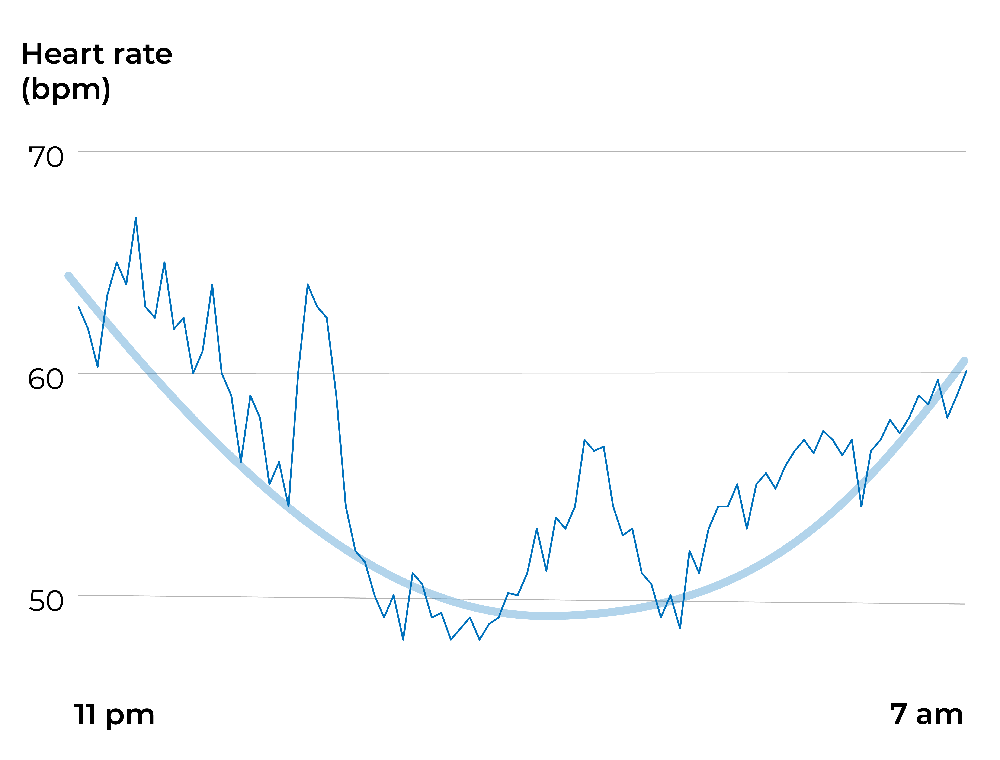

Night-time heart rate is a widely used metric in sleep tracking, and many trackers report your heart rate curve during the night. But what does it actually tell you?

During sleep and rest, your heart rate goes down. Lower heart rate indicates your body is recovering from the previous day. In general, a low resting heart rate is a sign of good cardiovascular health – the lower, the better. Typically in a healthy person, the night-time heart rate is somewhere around 50–60 bpm in the lowest point of the curve. However, heart rate values are individual and, therefore, hard to compare. Heart rate tends to get higher by age, and it is only natural for older people not to reach the same resting heart rate values that younger adults do. When interested in sleep and recovery, it makes more sense to compare your heart rate values with your average values from previous nights rather than population averages.

## Higher Heart Rate Indicates Poor Sleep

If your night-time heart rate scores higher than usual, it is more than likely you had issues in your sleep that night. Several factors can elevate your heart rate during the night.

#### Mental Overload

[Stress, alertness, and emotional or cognitive overload](https://nyxo.app/lesson/difficulty-falling-asleep) are among the most typical causes of sleeping troubles. In these cases, something in your life or surroundings (be that work, relationship worries, or video games) activates fight or flight reaction in your body. Your heart rate gets high, stress hormone levels elevated, and your whole body alerted. As useful as this may be in some situations, in the evening-time, it makes falling asleep very difficult and severely disrupts your sleep. Unusually high heart rate at the beginning of the night might indicate mental overload.

#### Physical Overload

Physical overload can have similar effects as mental overload. Overtraining is a state that occurs if a person exercises so hard that they exceed their body's ability to recover. Elevated night-time heart rate is one of the signs telling the body isn't able to recover from the exercise even over the night. Working out too late in the evening may have similar effects if the body hasn't completely recovered from the physical activity before going to bed. This may be an issue, especially for older persons, since their bodies often need more time to recover from exercise than younger people.

#### Chemical Substances

[Alcohol](https://nyxo.app/lesson/alcohol-myths-and-facts), [nicotine](https://nyxo.app/lesson/how-nicotine-affects-your-sleep), and [caffeine](https://nyxo.app/lesson/addicted-to-caffeine) can all elevate your heart rate during the night and disrupt your sleep.

#### Sickness

If you have a fever, your resting heart rate gets higher than usual.

#### REM Sleep

REM sleep and dreaming may temporarily raise your heart rate, causing brief peaks in the nightly curve. However, these peaks are perfectly normal and do not necessarily indicate you were sleeping restlessly.

## Heart Rate Patterns Tell About Your Rhythms

Often more important than the absolute heart rate values are the patterns you can see in your nightly heart rate curve. They can easily tell whether you sleep in sync with your biological rhythms.

The dip in your heart rate at night is driven both by the circadian clock and your actual sleeping behavior (the fact that you are resting). The optimal night-time heart rate curve is U-shaped: the heart rate starts to decrease after falling asleep, reaches its lowest around the midpoint of your sleep, and then slowly increases till you wake up. This is a typical pattern for a restful night. Essentially, it tells you went to bed relaxed and at the right time during your bedtime window, slept soundly through the night, and woke up refreshed around your natural wake-up window.

A U-shaped heart rate curve shows that your circadian rhythm is aligned with your sleeping behavior. Living in sync with your biological clock is the number one secret to good and healthy sleep. Circadian misalignment can easily be detected from the heart rate pattern. For instance, if you went to bed too late, your heart rate might begin to rise way too early in the morning. Or if you slept too little, the curve might still be at the low-point when waking up, making your morning a slumberous nightmare.
